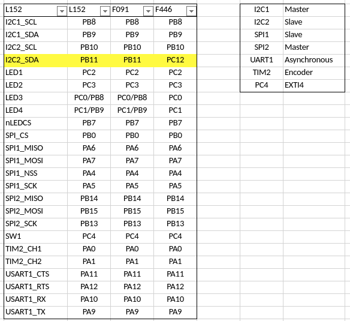

# Akashi-01
A Test jig board for the Murasaki library. Testing I2C, SPI, and UART on the Nucleo 64. This project is for Murasaki development. Not for the Murasaki application developer. 

## Functionality
This board is designed to test the serial port's functionality of the STM32 series MCU. The connectors can be directly mounted on the Nucleo 64 series board. With this board, the following can be tested :
- Serial Port TX and RX. With/without hardware handshake.
- I2C port Master and Slave. 
- SPI port Master and Slave. 

All above are achieved by connecting peripheral port head-to-head ( Serial port is an exception. It just tied TX to RX and RTS to CTS respectively). In addition to these test feature, additional parts can be mount : 
- Serial 7 segments LED display by Spark fun. 
- Rotary encoder with a switch to test the encoder functionality of timer and EXTI (External Interrupt of the STM32 MCU). 

## Development
- [KiCad 5.1](http://kicad-pcb.org/blog/2019/03/KiCad-5.1.0-Release/)
- [Nucleo F091RC](https://www.st.com/ja/evaluation-tools/nucleo-f091rc.html)
- [Nucleo L152RE](https://www.st.com/ja/evaluation-tools/nucleo-l152re.html)
- [Nucleo F446RE](https://www.st.com/ja/evaluation-tools/nucleo-f446re.html)

The schematics [can be downloaded](docs/Akashi-01.pdf) as PDF format. 

## Usage
The test program works with this board will be published as [murasaki_test_fundamental](https://github.com/suikan4github/murasaki_test_foundemental) project in future. 

If you develop a software works with this board, that software has to follow the pin configuration below. Note that the master-slave configuration is critical. If wrong, the MCU may be broken. 

I2C2_SDA is PB11 for both Nucleo L152RE and F091RC. But it is PC12 for the Nucleo F446RE.

**CAUTION** : Nucleo F446 CN10 pin 18 have to be cut. This pin is connected to VCAP1 pin of the STM32F446 internally. The VCAP1 is not for the peripheral usage. Thus, cutting pin 18 is not problem.

## License
This PCB design is released under the [Creative Commons Attribution 4.0 International license](https://creativecommons.org/licenses/by/4.0/). You are welcome to use this design for commercial purposes. 